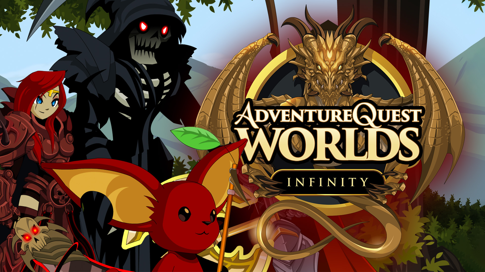

# 2024.2-Adventure-Quest-World
Repositório para desenvolvimento do jogo Adventure Quest World da disciplina de SBD1 - 2024.2

## Integrantes da equipe

| Nome         | Perfil do github                                 | Matrícula|
|--------------|--------------------------------------------------|----------|
| Arthur Ribeiro | [artrsousa1](https://github.com/artrsousa1)        | 221007850 |
| Bruno Bragança | [brunobreis](https://github.com/brunobreis)      | 221007902 |
| Caio Habibe Falcão| [caiohabibe](https://github.com/caiohabibe)| 221021868 |
| Henrique Quenino  | [henriquecq](https://github.com/henriquecq)            | 221008098 |

## Videos de apresentação

| Módulo         | Link da gravação       | Data |
|----------------|------------------------|------|
| 1              | [Apresentação Módulo 1](https://youtu.be/rttzNn9oLz4) | 25/11/2024 |

## Entregas

- Módulo 1
  - [DER(Diagrama Entidade Relacionamento)](./Modulo_1/DER(Diagrama_Entidade_Relacionamento).png)
  - [ME-R(Modelo Entidade Relacionamento)](./Modulo_1/ME-R(Modelo_Entidade_Relacionamento).md)
  - [DD(Dicinario de Dados)](./Modulo_1/DD(Dicinario_de_Dados).md)
- Módulo 2
  - [DD(Dicinario de Dados)](./Modulo_2/DD(Dicinario_de_Dados)_v1.1.md)

